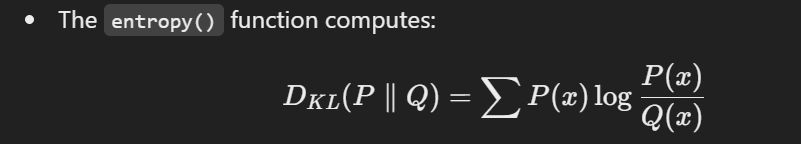

x# **Kullback-Leibler Divergence (KLD) in Image Processing**

Kullback-Leibler Divergence (KLD) is a measure of how much one probability distribution **differs** from another. In image processing, it is used to compare histograms of pixel intensities.

## **Mathematical Definition**


where:

- \( P(i) \) is the observed (image) probability distribution.
- \( Q(i) \) is the reference (expected) probability distribution.
- \( D\_{KL} \) measures how much **information loss** occurs when using \( Q(i) \) instead of \( P(i) \).

## **KLD Characteristics in Images**

- **If \( D\_{KL} = 0 \)**: The two distributions are identical.
- **If \( D\_{KL} \) is high**: The distributions differ significantly.

## **KLD Calculation in Images**

1. Compute the **histogram** of an image channel (e.g., grayscale or RGB).
2. Normalize the histogram to obtain a probability distribution.
3. Compare it with a **uniform distribution** or another reference distribution.

## **Applications**

✅ **Texture Classification** - Distinguishes different textures in an image.  
✅ **Watermark Detection** - Differences in watermark distributions can be detected using KLD.  
✅ **Image Similarity** - Used for comparing images based on histogram distributions.  
✅ **Anomaly Detection** - Identifies unusual patterns in medical images or surveillance footage.

## **Python Code for KLD Calculation**

```python
import numpy as np
from scipy.stats import entropy
from skimage.io import imread
import matplotlib.pyplot as plt

# Load image
image = imread("example.jpg")
image_gray = np.mean(image, axis=2) / 255.0  # Convert to grayscale and normalize

# Compute histogram
hist, _ = np.histogram(image_gray, bins=256, range=(0, 1), density=True)

# Reference uniform distribution
ref_hist = np.ones(256) / 256

# Calculate KLD
kld_value = entropy(hist, ref_hist)
print(f"KLD Value: {kld_value}")
```
